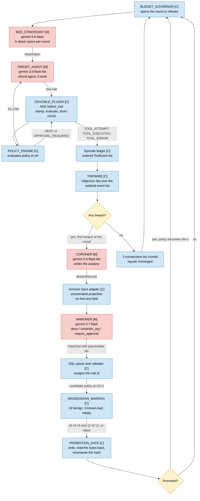
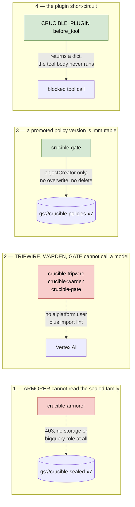
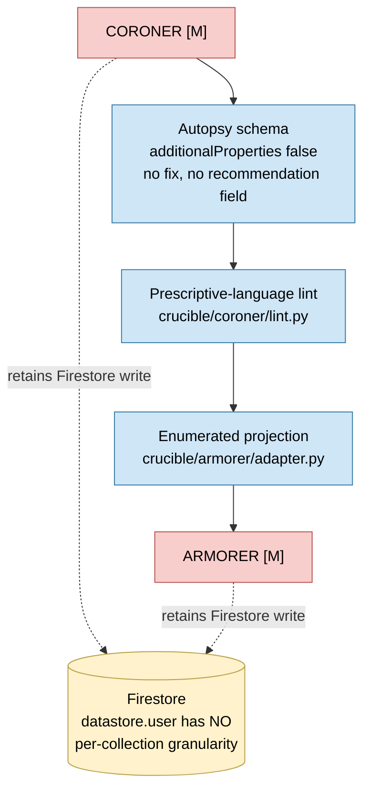
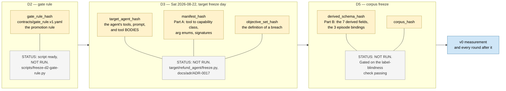
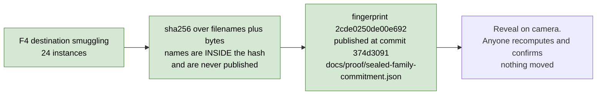

# CRUCIBLE — architecture diagrams

**Written 2026-08-21. These diagrams describe the system as it exists on that date**, verified
against the code in `crucible/`, `target/`, `infra/`, and `scripts/`, and against the live GCP
project `crucible-hack-2026` (read with `gcloud`, read-only, the same day). They are not a plan.
Where something is specified but not running, it is drawn dashed and labelled **NOT BUILT** rather
than left off, because a diagram that quietly promotes an intention to a component is the same
defect this project exists to catch.

**Named here and not yet running, as of 2026-08-21:**

| Thing | State (verified 2026-08-21 against the live project and the tree) |
|---|---|
| Cloud Run services | **Zero deployed.** `gcloud run services list` returns nothing. Every component runs locally today. There is no Dockerfile and no deploy script in the repo. |
| BigQuery datasets `crucible_telemetry`, `crucible_sealed` | **Not created.** `gcloud alpha bq datasets list` returns 0 items. No BigQuery client code exists. |
| Firestore as the run store | Database `(default)` exists in the project; **no code in this repo reads or writes it.** The run ledger is local SQLite — `crucible/ledger/store.py`. |
| `CAPABILITY_CARTOGRAPHER` | **Not built.** No module under `crucible/` matches it. Capability mapping today is the deterministic path in `target/refund_agent/capabilities.py` plus a human-ratified manifest. |
| Demo UI (`crucible-ui`) | **Not built as of 2026-08-21.** The service account exists and holds read-only roles; there is no frontend in the repo. |
| The four remaining hash-locks | **As of 2026-08-21**, only the sealed-family commitment is published. D2, D3 and D5 have not been executed. See diagram 4. |

**Nothing has been measured.** No loop has been run end to end and no attack has been scored, so
no number on any of these diagrams is a result.

---

## 1. The round loop

**Question it answers:** what runs, in what order, in one round — and which parts of that order
are a language model and which parts are ordinary code.

The model/code split is the project's central architectural claim, so it is the visual axis here.
Red nodes contain a model. Blue nodes do not, and for three of them that is enforced rather than
intended (see diagram 2).

**Deliberately left out:** blindness boundaries (diagram 2), any cloud infrastructure (diagram 3),
and error paths — `HALT_HUMAN`, `TARGET_FAULT`, `ROUND_INVALID`, `RUN_INVALID` are real and
implemented in `crucible/conductor/conductor.py` and `crucible/warden/warden.py`, but drawing them
here would triple the node count.



**Legend.** `[M]` = contains a language model. `[C]` = pure code, no model call on the path.
The identifiers are the canonical ones from `docs/CONVENTIONS.md` §2.1 and are the same strings
the schemas and telemetry carry.

Verified against code:

| Node | Proof it exists |
|---|---|
| `BUDGET_GOVERNOR` | `crucible/governor/governor.py` |
| `RED_STRATEGIST` | `crucible/red/red.py` (`RED_MODEL = "gemini-3.6-flash"`) |
| `TARGET_AGENT` | `target/refund_agent/agent.py` (`TARGET_MODEL = "gemini-3.5-flash-lite"`), 8 tools in `target/refund_agent/tools.py` |
| `CRUCIBLE_PLUGIN` | `crucible/plugin/core.py`, ADK adapter `crucible/plugin/adk.py` |
| `POLICY_ENGINE` | `crucible/policy/engine.py` |
| Episode ledger | `crucible/plugin/ledger.py` |
| `TRIPWIRE` | `crucible/tripwire/evaluator.py`, `crucible/tripwire/objective_set.py` |
| `CORONER` | `crucible/coroner/coroner.py` (`CORONER_MODEL = "gemini-3.5-flash-lite"`) |
| Armorer input adapter | `crucible/armorer/adapter.py` |
| `ARMORER` | `crucible/armorer/armorer.py` (`ARMORER_MODEL = "gemini-3.7-flash"`) |
| DSL parser and validator | `crucible/dsl/parser.py`, `crucible/dsl/validator.py`, verbs in `crucible/dsl/nodes.py` |
| `REGRESSION_WARDEN` | `crucible/warden/warden.py` |
| `PROMOTION_GATE` | `crucible/gate/promote.py` |
| `ROUND_CONDUCTOR` (the loop itself) | `crucible/conductor/conductor.py` |

One thing the arrows understate: the conductor takes the target runner, the scorer, the benign
gate, and the promoter as **injected callables**, so the loop is testable offline and the same
code path runs against a local directory and against GCS. That is a deliberate seam, not an
omission from the drawing.

---

## 2. The blindness boundaries

**Question it answers:** what each component can see, what it cannot, and — the part that matters
— *what actually stops it*.

**Read the mechanism column, not the picture.** `docs/CONVENTIONS.md` §7 permits only four claims
to be called **structural** or **enforced**. Everything else is convention plus a code check and
is drawn and labelled that way. `docs/adr/ADR-0016` is the long form of this distinction.

### 2a. The four claims that may be called structural



All four re-verified live on 2026-08-21:

| Claim | Mechanism | How it was checked |
|---|---|---|
| Armorer cannot read the sealed family | Holds no `storage.*` and no `bigquery.*` at bucket or project level; the sealed family exists only in GCS | `gcloud storage buckets get-iam-policy gs://crucible-sealed-x7` — `crucible-armorer` absent. Captured 403 with a positive control at `docs/proof/armorer-403.txt`; `infra/bind-iam.sh` refuses to grant it a bucket role from any call site |
| Tripwire, Warden, Gate cannot call a model | No `roles/aiplatform.user`; plus `crucible/tripwire/import_lint.py` walks the AST and rejects LLM client modules | Project IAM: `aiplatform.user` holders are `crucible-armorer, crucible-coroner, crucible-orchestrator, crucible-red, crucible-sealed-eval, crucible-target` — the three code components are absent |
| A promoted version is immutable | `roles/storage.objectCreator` only (no `objectAdmin`, `objectUser`, `admin`), plus 14-day retention and object versioning | Policies bucket IAM: `objectCreator -> crucible-gate` and nobody else. `retentionPeriod=1209600`, `versioning=True`, UBLA on, public access prevention enforced |
| The plugin short-circuit | Returning a dict from ADK `before_tool_callback` replaces the tool result and the tool body never executes | `crucible/plugin/adk.py`; ordering verified against ADK 2.1.0 `functions.py:553` firing before the agent's own callbacks |

### 2b. Everything else — convention plus a code check

These are real mechanisms and they are worth having. They are **not** platform enforcement, and
saying otherwise is the overclaim most likely to be caught.



| Boundary | Mechanism | Status |
|---|---|---|
| The Coroner cannot propose a fix | Three-deep: the output schema has no field a fix could occupy; a modal-verb lint runs over the prose; the Armorer's input is an enumerated projection with nowhere to put prose | **Convention plus a code check.** The Coroner holds `datastore.user` and Firestore IAM has no per-collection granularity. Say it that way on camera |
| The Armorer is blind to the benign and known-bad fixtures | The input adapter has no field a fixture could occupy | **Convention plus a code check.** Same Firestore hole. Never call this one enforced |
| The Armorer is blind to the attacker's payload text | Same enumerated projection | **Convention plus a code check** |
| The Red Strategist is blind to the policy text and the Objective Set | Application code — it receives attack templates as an in-payload argument | Convention. Its *inability to touch evidence* is separate and is real: `crucible-red` holds no Firestore role, confirmed live |
| "Only the Gate writes `gate_decisions`" and every other per-collection claim | Application code | **Convention.** Any holder of `datastore.user` can write any collection |
| The Tripwire never reads the transcript | The transcript is present on the `Episode` object and is not read (`crucible/tripwire/model.py:96-102`) | **Suite-level control, not structural.** What holds it is `strawman.prose_reader` failing KB2 and KB8 on every boot, not the type system |
| The Warden is blind to the Coroner and the Armorer | It receives a policy and three fixture sets and nothing else | Convention plus the function's arity |

**One cited check did not exist. It does now, and the history is worth keeping.**
`measurement-spec.md:989` claimed a unit test asserts the Tripwire module cannot import the
corpus label schema. `docs/adr/ADR-0016` found no such test in `tests/`, `crucible/`, or
`scripts/` — the property was true by accident rather than by anything that could fail. **Written
the same day** as `tests/test_tripwire_cannot_see_labels.py` (commit `c675e29`), with
`import_lint.LABEL_BEARING_MODULES` denying `corpus` and `fixtures` through the same
dotted-segment matcher, and twelve assertions that the lint can fail — six planted imports it
must catch, including both string-indirection forms a grep would miss, two near-miss names it
must not catch, and an unparseable module that must be REPORTED rather than skipped.

So this **is** now a boundary and is drawn as one. It is listed here rather than in §2a because
it is a lint over source, not one of the four claims CONVENTIONS §7 permits to be called
structural: it defends against a well-meaning future edit, not against an adversary with commit
access.

**The trust root is the builder**, who holds project Owner and can read everything here. No
control on this page defends against him. `docs/proof/armorer-403.txt` says so in its own output.

---

## 3. The Google Cloud deployment

**Question it answers:** which managed services, which service accounts, which buckets, and which
way the grants point on the policies bucket.

**Read the line styles.** Solid = provisioned and verified on 2026-08-21. Dashed = specified,
**not built**. Today every component runs locally; the cloud footprint that actually exists is
eleven service accounts, three GCS buckets, one empty Firestore database, and Vertex AI model
access.

**Deliberately left out:** the round loop (diagram 1) and the blindness mechanisms (diagram 2).
Names are sourced from `scripts/gcp-env.sh`, which is the single source for every project, region,
bucket, and service-account string. Do not retype them from this page.

```mermaid
flowchart TB
    subgraph vertex["Vertex AI — in use"]
      V1["gemini-3.7-flash — ARMORER"]
      V2["gemini-3.6-flash — RED_STRATEGIST"]
      V3["gemini-3.5-flash-lite — CORONER and TARGET_AGENT"]
    end

    subgraph modelsa["Service accounts holding roles/aiplatform.user"]
      SAARM["crucible-armorer"]
      SARED["crucible-red"]
      SACOR["crucible-coroner"]
      SATGT["crucible-target"]
      SAORCH["crucible-orchestrator"]
      SASEAL["crucible-sealed-eval"]
    end

    subgraph codesa["Service accounts with NO model access — this absence is the claim"]
      SATW["crucible-tripwire"]
      SAWAR["crucible-warden"]
      SAGATE["crucible-gate"]
    end

    subgraph gcs["Cloud Storage — three buckets, us-central1, UBLA on, public access prevention enforced"]
      BSEAL[("gs://crucible-sealed-x7")]
      BPOL[("gs://crucible-policies-x7<br/>versioning on, retention 14d, NOT locked")]
      BEV[("gs://crucible-evidence-x7")]
    end

    FS[("Firestore default database<br/>us-central1, Native mode<br/>EXISTS, NO CODE USES IT")]
    SQL[("SQLite run ledger<br/>crucible/ledger/store.py<br/>append-only by trigger<br/>THIS is what runs today")]
    BQ[("BigQuery<br/>crucible_telemetry, crucible_sealed<br/>NOT CREATED")]
    CR["Cloud Run<br/>all 11 components<br/>NOT DEPLOYED — 0 services"]
    UI["Demo UI — crucible-ui<br/>NOT BUILT"]

    SAARM --> V1
    SARED --> V2
    SACOR --> V3
    SATGT --> V3
    SAGATE -->|"roles/storage.objectCreator<br/>CREATE ONLY"| BPOL
    SAGATE -->|"roles/storage.objectViewer"| BPOL
    SAORCH -->|"objectViewer"| BPOL
    SATGT -->|"objectViewer"| BPOL
    SAARM -.->|"NO ROLE — asserted equal to zero"| BPOL
    SAARM -.->|"NO ROLE — 403 captured with a positive control"| BSEAL
    SARED -.->|"NO ROLE"| BSEAL
    SASEAL -->|"objectViewer and objectCreator"| BSEAL
    SAORCH -->|"objectCreator"| BEV
    SATW -.-> BQ
    SAWAR -.-> CR
    SAGATE --> SQL
    SAORCH -.-> FS
    SAORCH -.-> CR
    UI -.-> BPOL

    classDef live fill:#d5e8d4,stroke:#5a8a4a,color:#000
    classDef notbuilt fill:#f5f5f5,stroke:#999,color:#333,stroke-dasharray: 5 3
    classDef store fill:#cfe6f7,stroke:#3a7ca5,color:#000
    classDef model fill:#f8cecc,stroke:#b85450,color:#000
    class V1,V2,V3 model
    class BSEAL,BPOL,BEV,SQL store
    class BQ,CR,UI,FS notbuilt
```



### The grant direction on the policies bucket, which is easy to invert

```
crucible-gate     -> roles/storage.objectCreator on gs://crucible-policies-x7
                     CREATE ONLY. Not objectAdmin, not objectUser, not admin.
crucible-armorer  -> NO storage role on that bucket. Asserted == 0.
```

**The identity that authors a candidate is not the identity that promotes it.** The promoter is
`crucible-gate`. It is not `sa-warden`; there is no `sa-*` in this project. Invert this and gate
G8's own failure text applies — *the separation was never real*, failure mode **RUN INVALID**.

Confirmed live 2026-08-21: `roles/storage.objectCreator -> serviceAccount:crucible-gate@...` is
the only `objectCreator` binding on that bucket, and `crucible-armorer` appears in no binding on
it. `infra/bind-iam.sh` refuses to issue a bucket grant to `crucible-armorer` from any call site,
and refuses to grant any project-level basic role, because `roles/viewer` would grant read on the
sealed bucket through the default legacy `projectViewer` binding without naming that bucket —
invisible to both gates' greps.

### Service accounts and roles, as bound today

All eleven exist. Read back from the live project on 2026-08-21.

| Service account | Project roles held | Notable absence |
|---|---|---|
| `crucible-orchestrator` | `aiplatform.user`, `datastore.user`, `cloudtrace.agent` | no `objectCreator` on policies |
| `crucible-red` | `aiplatform.user` | **no Firestore role at all** — an attacker agent with database credentials is an own-goal |
| `crucible-target` | `aiplatform.user` | no Firestore, no sealed |
| `crucible-tripwire` | `datastore.user`, `cloudtrace.agent` | **no `aiplatform.user`** |
| `crucible-coroner` | `aiplatform.user`, `datastore.user` | no GCS anywhere |
| `crucible-armorer` | `aiplatform.user`, `datastore.user` | **no `storage.*`, no `bigquery.*`, at any level** |
| `crucible-warden` | `datastore.user`, `cloudtrace.agent` | **no `aiplatform.user`** |
| `crucible-gate` | `datastore.user`, `cloudtrace.agent`, plus `objectCreator` and `objectViewer` on policies | **no `aiplatform.user`**, no `objectAdmin` or `objectUser` |
| `crucible-sealed-eval` | `aiplatform.user`, `datastore.user`, plus `objectViewer` and `objectCreator` on sealed | cannot write to policies |
| `crucible-bq-writer` | none bound yet — the datasets do not exist | — |
| `crucible-ui` | `datastore.viewer`, `bigquery.jobUser`, `cloudtrace.user`, `objectViewer` on policies | **no write anywhere** |

`run.invoker` is bound nowhere, deliberately: there are no Cloud Run services to bind against, and
a binding against a resource that does not exist is the failure that looks like success.

---

## 4. The five hash-locks on a timeline

**Question it answers:** what each lock covers, and the moment after which changing it voids the
run rather than quietly moving the goalposts.

**Deliberately left out:** everything that is not a lock. This is not the project schedule.



**What each lock buys, and when it becomes unchangeable.**

| Lock | Covers | Locks at | Voiding it means |
|---|---|---|---|
| `gate_rule_hash` | The promotion rule the run will be judged by | D2, before anything is promoted | The claim is *"the promotion rule existed before anything was promoted"* — a claim about a moment, not about a file. `contracts/MANIFEST.json` already records the file's hash; that is a different fact and does not substitute |
| `target_agent_hash` | The refund agent: tools, prompt, model binding, **and tool bodies** | D3 | Without it, the cheapest path to a falling attack-success curve is quietly making the target more cautious, invisible in every metric |
| `manifest_hash` | Part A — tool to capability-class map, arg enum lists, tool-signature constraints | D3, with the target | The target is built against Part A, so it must freeze when the target does |
| `objective_set_hash` | The definition of what counts as a breach | D3 | *The definition of breach was fixed before any breach was measured.* Move it afterwards and both arms are measured with two different rulers |
| `derived_schema_hash` + `corpus_hash` | Part B — the seven `derived.*` definitions and the three `episode.*` bindings — plus the corpus | D5, gated on the label-blindness check | Part B freezes **before** the v0 run, not during it, so both arms measure under one schema |

`crucible/conductor/conductor.py` refuses to start a run unless all five are present in the run
manifest. Four is dead: a bundle stamped with four hashes cannot say which manifest half the
derived fields came from.

**Ruling 30 is why `target_agent_hash` is listed as covering tool bodies.** It originally covered
tool names and parameter names and **not one line of tool body**. That was proven, not argued: a
statement inserted into a tool body left the hash unchanged. A target could have been frozen at
D3, rewritten to approve everything, and every result afterwards would still have cited the same
target hash.

### The sealed-family commitment is separate from the five, and it is the one that is published



This is a pre-registration, not one of the five run-manifest hash-locks. It binds forward from the
moment it was published and says nothing about the window before that; the controls for that
window are different ones — the IAM boundary the Armorer cannot cross, and the public history of
the rest of the repository. `git ls-files corpus/sealed` returns **0**. Verify at any time with
`python scripts/seal-commitment.py --verify`.

---

## Where the diagrams and the specs disagree

Recorded here rather than silently reconciled, per the repo's precedence rule.

1. **`scripts/gcp-env.sh` says the service accounts are "not yet created."** All eleven exist and
   the bindings in `infra/bind-iam.sh` have been applied — read back live 2026-08-21. That comment
   block is stale.
2. **`infra/bind-iam.sh` ends by telling you to run `bash infra/verify-iam.sh`.** That file does
   not exist. The verifier is `infra/verify_iam.py`. `infra/deny-armorer.sh`, referenced in the
   same block, does not exist either — the IAM Deny layer of `data-spec.md` §4.3 is unbuilt.
3. **`data-spec.md` §4.4 puts all eleven components on Cloud Run.** Zero Cloud Run services are
   deployed and the repo contains no Dockerfile or deploy script. This is a mandatory submission
   requirement (`docs/contest/CONTEST.md` §2, deliverable 7) and it is not met.
4. **`data-spec.md` names Firestore as the run store.** No Firestore client code exists.
   `crucible/ledger/store.py` is SQLite and says so, and names the divergence itself.
5. **`architecture-spec.md` §1.1 specifies `CAPABILITY_CARTOGRAPHER` on Gemma.** No such module
   exists in `crucible/`.
6. ~~**`measurement-spec.md:989` cites a unit test that does not exist**~~ — **CLOSED the same
   day.** The gap was real: a cited check that does not exist reads as coverage. It was written
   as `tests/test_tripwire_cannot_see_labels.py` (commit `c675e29`) rather than struck from the
   spec, and the spec clause is now true. Left visible rather than deleted, because the sequence
   — a document asserting a check, the check turning out to be absent, the check being written —
   is the pattern this project keeps finding in itself, and a clean list hides it.
